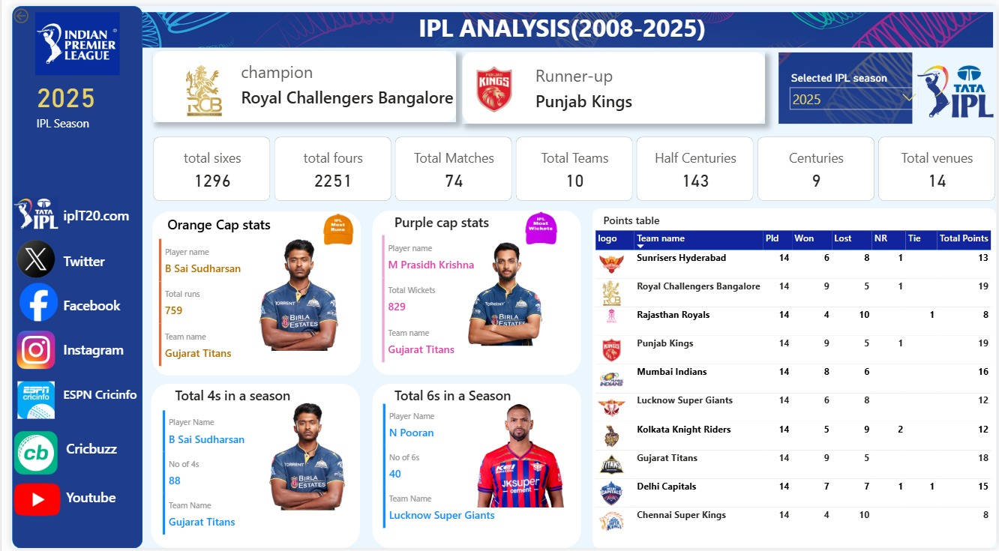

# 🏏 IPL Analysis Dashboard (2008–2025)

## 📌 Project Overview

The **IPL Analysis Dashboard (2008–2025)** is an interactive Power BI project that provides comprehensive insights into the Indian Premier League. It enables users to explore season-wise statistics, team performance, player achievements, and tournament trends through dynamic visualizations and interactive filters.

This dashboard is designed to help cricket enthusiasts, analysts, and decision-makers gain valuable insights into IPL data in an intuitive and visually appealing manner.

---
## 📸 Dashboard Preview



## 🚀 Features

- 📅 Season-wise IPL analysis (2008–2025)
- 🏆 Champion & Runner-up details
- 🟠 Orange Cap winner statistics
- 🟣 Purple Cap winner statistics
- 📊 Team Points Table
- 🏏 Total Matches
- 👥 Total Teams
- 🏟️ Total Venues
- 💥 Total Sixes
- 🏏 Total Fours
- 💯 Total Centuries
- 5️⃣ Total Half-Centuries
- 🎯 Most Fours in a Season
- 🚀 Most Sixes in a Season
- 🎛️ Interactive season filter

---

## 🛠️ Tools & Technologies

- Microsoft Power BI
- Power Query
- DAX (Data Analysis Expressions)
- Data Modeling
- Data Visualization

---

## 📂 Dataset

The dashboard is built using publicly available IPL datasets containing:

- IPL Match Data
- Ball-by-Ball Data
- Player Statistics
- Team Information

---

## 📈 Key Insights

- Compare IPL champions and runners-up across seasons.
- Analyze Orange Cap and Purple Cap winners.
- Explore season-wise batting performance.
- Compare team standings using the points table.
- View overall tournament statistics such as total matches, teams, venues, boundaries, and milestones.

---

## 📁 Repository Structure

```
IPL-PowerBI-Dashboard/
│── IPL_Dashboard.pbix
│── dashboard.jpeg
│── README.md
```

---

## ▶️ How to Use

1. Clone this repository.

```bash
git clone https://github.com/yogitakore/IPL-PowerBI-Dashboard.git
```

2. Open **IPL_Dashboard.pbix** using **Microsoft Power BI Desktop**.

3. Explore the dashboard using the interactive season filter and visualizations.

---

## 📚 Skills Demonstrated

- Data Cleaning
- Data Modeling
- DAX Calculations
- Power Query
- Interactive Dashboard Design
- KPI Development
- Business Intelligence
- Data Visualization

---

## 👩‍💻 Developed By

**Yogita Kore**

Aspiring Data Scientist | Power BI Developer | Machine Learning Enthusiast

📌 GitHub: https://github.com/yogitakore

---

⭐ If you found this project useful, consider giving it a star!
